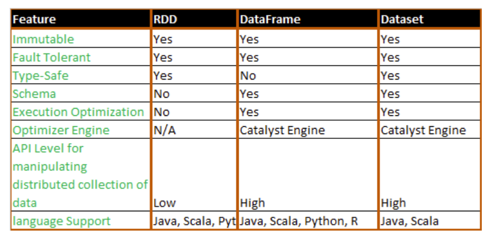
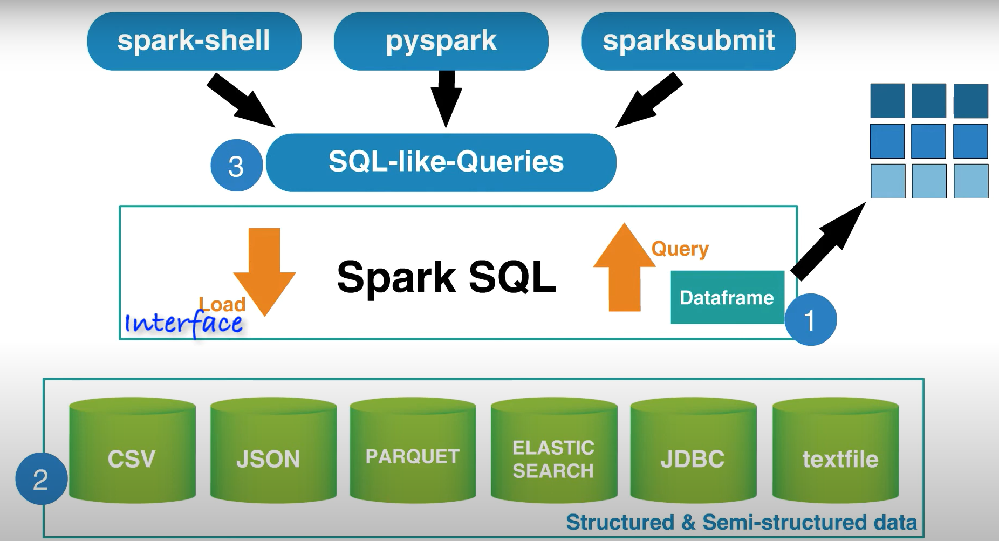
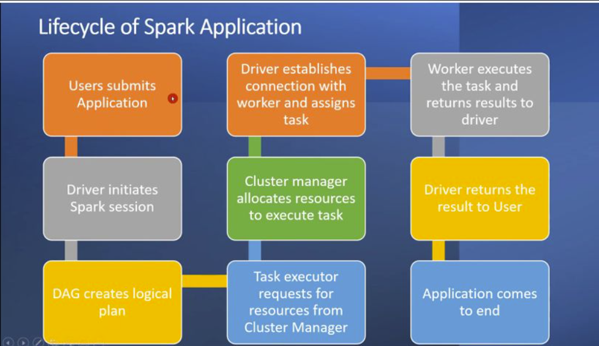

# DataEngineering-Spark-2
PySpark Project to Learn Advanced DataFrame

## Project Description

## Overview

Apache Spark is an open-source, distributed computing framework designed for processing and analyzing large-scale datasets. It provides a unified engine that supports various data processing tasks, including batch processing, interactive queries, streaming, machine learning, and graph processing. Spark is implemented in Scala and offers APIs in Scala, Java, Python (PySpark), and R (SparkR).

PySpark stands as a robust open-source tool designed to process and analyze data across a network of computers. It presents a Python interface to Apache Spark, a swift and versatile system for distributed computing. Here are a few explanations for PySpark's extensive adoption: handling vast amounts of data, quick and efficient operations, staying resilient and scalable even when issues arise, seamless collaboration with the Python environment, intricate data analysis capabilities, and being a part of a supportive community and ecosystem.

## Spark RDD Vs DataFrame Vs DataSet

## Spark SQL

 

## Aim:

This is continuation to DataEngineering-Spark-1

The aim of this project is to provide a comprehensive exploration of essential concepts and practical aspects of Apache Spark, focusing on data manipulation, querying, and performance optimization. The project will consist of multiple parts, covering the comparison between Spark Datasets and Spark DataFrames, the utilization of Spark SQL for querying structured data, recapitulation of Spark SQL and its joins, in-depth analysis of Spark's performance and optimization techniques, understanding query execution plans, exploration of Spark User-defined Functions (UDFs), guidance on running Spark Jobs locally and in the cloud, and finally, a comparative study of the features and enhancements introduced in Spark 3.0 as compared to Spark 2.0. Through these segments, you will gain a thorough understanding of Spark's core components, advanced querying capabilities, performance considerations, and deployment options, enabling them to make informed decisions and leverage Spark effectively for their data processing and analysis needs.

## Data Description:

The TLC (Taxi and Limousine Commission) Trip Record Data refers to a dataset that contains detailed information about taxi trips in New York City. This dataset is made available by the TLC, which regulates and oversees the taxi and for-hire vehicle industry in the city.

The TLC Trip Record Data includes various attributes for each taxi trip, such as the pickup and drop-off locations, trip distance, trip duration, fare amount, payment type, and additional surcharges. It also provides information about the taxi's unique identifier, driver details, and other relevant trip-related information.

The dataset is often used for a wide range of purposes, including transportation analysis, urban planning, predictive modeling, fare optimization, and studying travel patterns in the city. Researchers, data scientists, and analysts can leverage this dataset to gain insights into taxi usage, passenger behavior, and transportation trends.

Analyzing the TLC Trip Record Data typically involves processing and cleaning the dataset, performing exploratory data analysis, and applying various statistical and machine learning techniques to derive meaningful insights. The large volume and complexity of the dataset often require tools and frameworks like PySpark or Apache Spark for efficient data processing and analysis.

Access to the TLC Trip Record Data allows for a deeper understanding of taxi operations and transportation dynamics in New York City, enabling data-driven decision-making and improvements in the transportation system.

 ### Dataset Used

Data Source: 2023 (https://www.nyc.gov/site/tlc/about/tlc-trip-record-data.page)

## Tech Stack

Language: Python, SQL

Package: PySpark

## Spark Life Cycle

Here is the Data Analysis:

[lab_1_notebook.ipynb](https://github.com/Raghuraj-DataEngineer/DataEngineering-Spark-1/blob/main/lab_1_notebook.ipynb)

[lab_2_notebook.ipynb](https://github.com/Raghuraj-DataEngineer/DataEngineering-Spark-1/blob/main/lab_2_notebook.ipynb)

[lab_3_notebook.ipynb](https://github.com/Raghuraj-DataEngineer/DataEngineering-Spark-1/blob/main/lab_3_notebook.ipynb)

[lab_4_notebook.ipynb](https://github.com/Raghuraj-DataEngineer/DataEngineering-Spark-1/blob/main/lab_4_notebook.ipynb)

 
